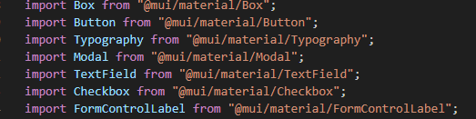
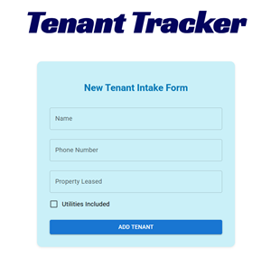
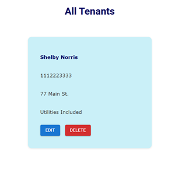
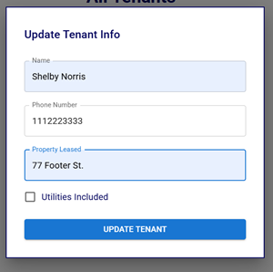

# Tenant Tracker

A CRUD web application designed for managing and organizing tenants in commercial real estate properties.

## Made with:

## Deployed with:

Check out [Tenant Tracker!](https://tenant-tracker-livid.vercel.app/)

## Features

- Add new tenants
- Update existing tenant information
  - Tenant's name
  - Tenant's phone number
  - Property being leased to that tenant
  - Whether or not their lease includes utilities in the monthly cost
- View a list of all current tenants
- Remove tenant from database

## Tenant Schema

Table name: **Tenants**

`{ id: String, name: String, phone: number, property: string, utilitiesIncluded: boolean }`

## Build Process

I first built the app with Vite, using component-based architecture and installing various dependencies. Then I set up the table in DynamoDB for data integration that allows the user to read, write, view, update, and delete data through the UI.

State management is utilized to reflect the database items on page load, to populate the MUI modal inputs with previously entered details, and to update the UI immediately after adding a new tenant, editing tenant information, and deleting the tenant from the database.

For styling, I worked with Sass CSS and Material UI (MUI) component library. The nesting features of SCSS worked well with all files and components, and the MUI components make the app look polished and modern.

Example of MUI component imports:

Media queries were utilized to make the app responsive across all screens, and modal responsiveness was edited in Main.jsx with the style object provided by MUI.

Since the app is built with Vite, Vitest is the chosen framework for unit testing.

## Screenshots

New Tenant Form

New Tenant Listed

Edit Tenant Info Modal

